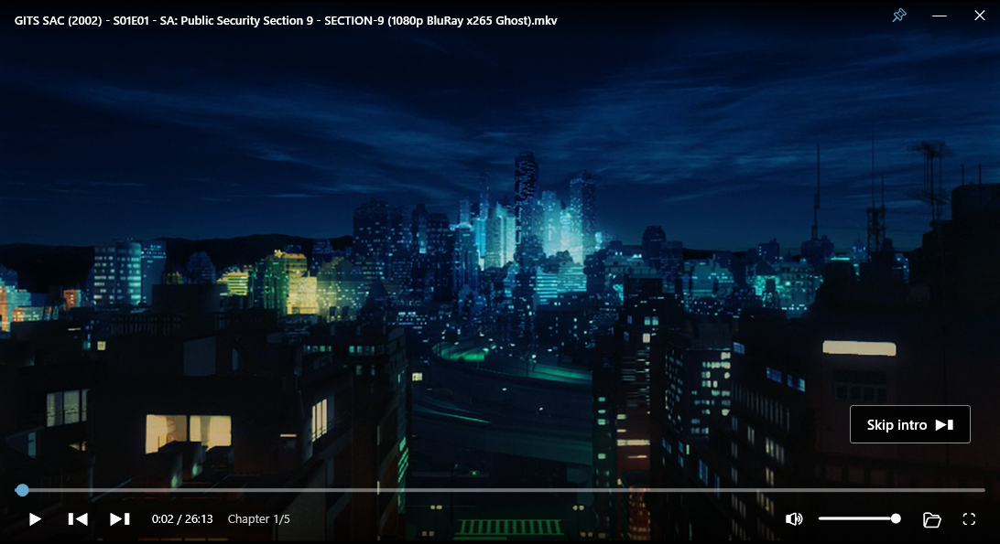
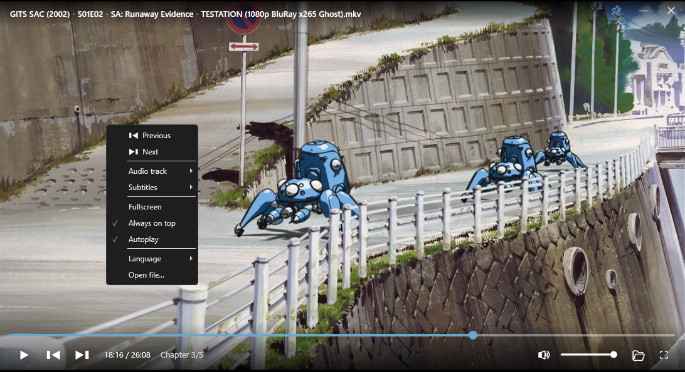

<h1 align="center">
  <br>
  Squeak
</h1>

[](https://github.com/Snorklefudge/squeak-player/releases/latest)
[](https://github.com/Snorklefudge/squeak-player/releases)
[](LICENSE)

A minimal, YouTube-style video player for Windows, built on [LibVLCSharp](https://github.com/videolan/libvlcsharp) (WPF). It plays anything VLC can, but wraps it in a clean, borderless, hover-to-reveal interface instead of the classic VLC chrome.

> The UI is in **English by default** and auto-switches to your Windows display language when it's one of the supported ones — **Polish, Spanish, French, Chinese, or Japanese**. You can also pick the language from the right-click menu.

## Screenshots

|  |  |
| :---: | :---: |
|  |  |
| Hover-to-reveal controls & skip-intro | Right-click menu (tracks, subtitles, language…) |

## Download

Grab the latest from the [**Releases page**](https://github.com/Snorklefudge/squeak-player/releases/latest). Two options:

- **Installer** — **`Squeak-Setup-x.y.z.exe`**. Installs Squeak with a Start-menu shortcut and, if your PC doesn't already have the [.NET 8 Desktop Runtime](https://dotnet.microsoft.com/download/dotnet/8.0), installs that automatically. Small download.
- **Portable** — **`Squeak-Portable-x.y.z-win-x64.zip`**. Fully self-contained: unzip anywhere and run `Squeak.exe`. No install and **no .NET runtime needed** (larger download since the runtime is bundled).

Either way — no VLC install needed.

## Features

- **Hover-to-reveal controls** — top bar and bottom control bar slide in on mouse movement and auto-hide after a couple of seconds.
- **Click anywhere to play/pause**, with a center flash animation.
- **Scrubbable timeline** — click and drag anywhere on the bar to scrub the video live, with a time preview on hover.
- **Volume** — slider + mute button, on-screen volume/seek feedback.
- **Previous / next** file in the folder, plus **autoplay** the next file when one ends.
- **Audio track & subtitle** selection (right-click menu).
- **Skip intro** button when a file has chapters.
- **Custom borderless window** — pin-on-top, minimize, close, drag to move, double-click / `F` for fullscreen (hides the taskbar).
- **Remembers** volume, always-on-top, language, and each file's playback position between sessions.
- **Drag & drop** a video onto the window to play it.

## Keyboard shortcuts

| Key | Action |
| --- | --- |
| `Space` / click | Play / pause |
| `←` / `→` | Seek ∓5 s |
| `↑` / `↓` | Volume ±5% |
| `M` | Mute |
| `T` | Pin on top |
| `F` | Fullscreen |
| `Esc` | Exit fullscreen |
| `Ctrl+O` | Open file |

## Requirements

- Windows 10 / 11 (x64)
- [.NET 8 Desktop Runtime](https://dotnet.microsoft.com/download/dotnet/8.0) — the installer downloads and installs it automatically if it's missing.

You do **not** need VLC installed; the libvlc binaries are bundled.

## Building from source

Requires the [.NET 8 SDK](https://dotnet.microsoft.com/download).

```powershell
git clone https://github.com/Snorklefudge/squeak-player.git
cd squeak-player
dotnet run --project SqueakPlayer.csproj
```

## Releases

Releases are automated. Pushing a version tag builds the installer with [Inno Setup](https://jrsoftware.org/isdl.php) and publishes it to GitHub Releases (see `.github/workflows/release.yml`):

```powershell
git tag v1.0.0
git push origin v1.0.0
```

## Credits & license

- Squeak's own code is released under the [MIT License](LICENSE).
- Playback is powered by **[VLC](https://www.videolan.org/vlc/) / libVLC** by the VideoLAN project, via **LibVLCSharp**. libVLC is licensed under the **LGPL v2.1+**; its binaries are redistributed unmodified.
